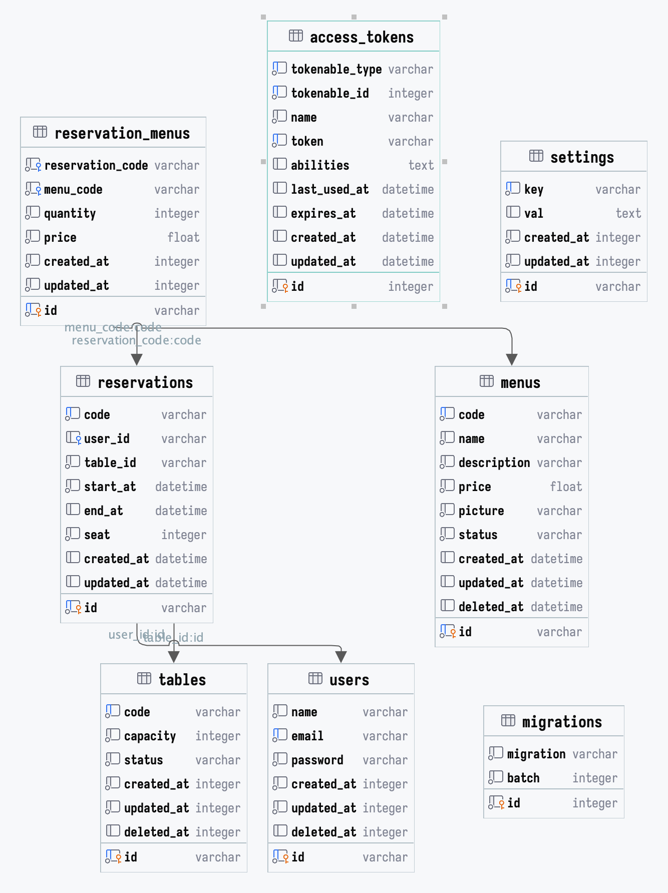

# WorkTest

## Assumptions & Considerations

[Read Assumptions & Considerations](ASSUMPTIONS_%26_CHALLENGES.md#assumptions--considerations)

## Challenges Faced and How to Overcome

[Read Challenges Faced & How to Overcome](ASSUMPTIONS_%26_CHALLENGES.md#challenges-faced-and-how-to-overcome-problems)

## Database Diagram



## Installation

Before installing, make sure the requirements below are met

- PHP 8.1 or later with
- SQLite or MySQL

### 1. Clone Repository

```
git clone https://github.com/SupianIDz/WorkTest
```

### 2. Set Up Database

Navigate to the project directory:

```shell
cd WorkTest
```

Create a copy of the .env.example file and name it .env:

```shell
cp .env.example .env
```

Create a SQLite database file

```shell
touch database/database.sqlite
```

Open the .env file and update the following fields with the absolute path to your project's SQLite database file:

```dotenv
DB_CONNECTION=sqlite
DB_DATABASE=/ABSOLUTE/PATH/TO/PROJECT/database/database.sqlite
```

Remember to replace /ABSOLUTE/PATH/TO/PROJECT with the actual absolute path to project directory.

### 3. Install Dependencies:

```
composer install
```

### 4. Run Migrations & Seeders

```
php artisan migrate --seed
```

### 5. Fork Api Collection

You can import data into Postman by dragging and dropping files [postman.json](postman.json), or by a [URL](https://raw.githubusercontent.com/SupianIDz/WorkTest/main/postman.json).
to your Postman App.

See the Postman [documentation](https://learning.postman.com/docs/getting-started/importing-and-exporting/importing-data/) for more information regarding Import Collections.

or run in post directly:

[](https://app.getpostman.com/run-collection/10481488-1d0e5b8e-3cd5-4652-b05a-c9525d575b7f?action=collection%2Ffork&source=rip_markdown&collection-url=entityId%3D10481488-1d0e5b8e-3cd5-4652-b05a-c9525d575b7f%26entityType%3Dcollection%26workspaceId%3Da66266ef-ff39-46cd-95a0-9b55d0d767a8#?env%5BTest%5D=W3sia2V5IjoiQkFTRV9VUkwiLCJ2YWx1ZSI6Imh0dHA6Ly8xMjcuMC4wLjE6ODAwMCIsImVuYWJsZWQiOnRydWUsInR5cGUiOiJkZWZhdWx0Iiwic2Vzc2lvblZhbHVlIjoiaHR0cDovLzEyNy4wLjAuMTo4MDAwIiwic2Vzc2lvbkluZGV4IjowfSx7ImtleSI6ImN1cnJlbnRkYXRlIiwidmFsdWUiOiIiLCJlbmFibGVkIjp0cnVlLCJ0eXBlIjoiYW55Iiwic2Vzc2lvblZhbHVlIjoiMjAyNC0wMi0xMiIsInNlc3Npb25JbmRleCI6MX0seyJrZXkiOiJEQVRFIiwidmFsdWUiOiIiLCJlbmFibGVkIjp0cnVlLCJ0eXBlIjoiYW55Iiwic2Vzc2lvblZhbHVlIjoiMjAyNC0wMi0xMiIsInNlc3Npb25JbmRleCI6Mn1d)

### 6. Run PHPUnit Tests (Optional)

```
php artisan test --coverage
```

### 7. Run Local Server

```shell
php artisan serve
```
